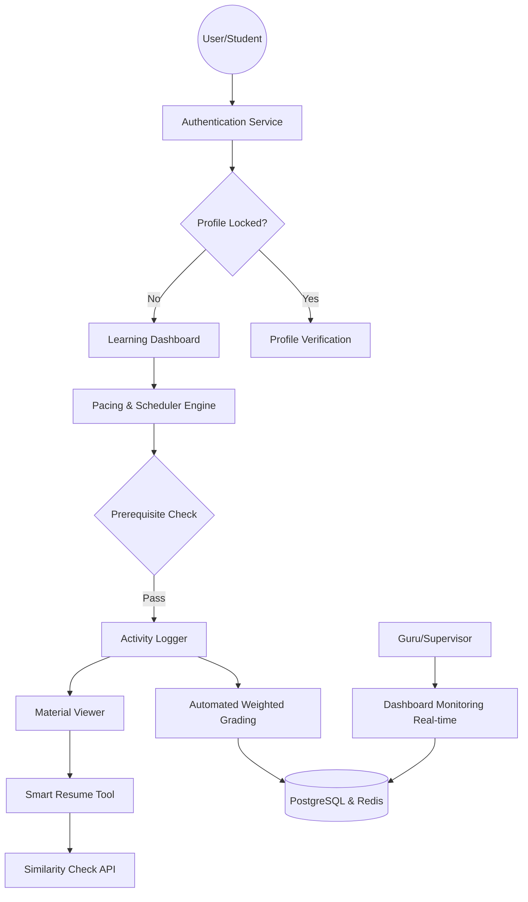
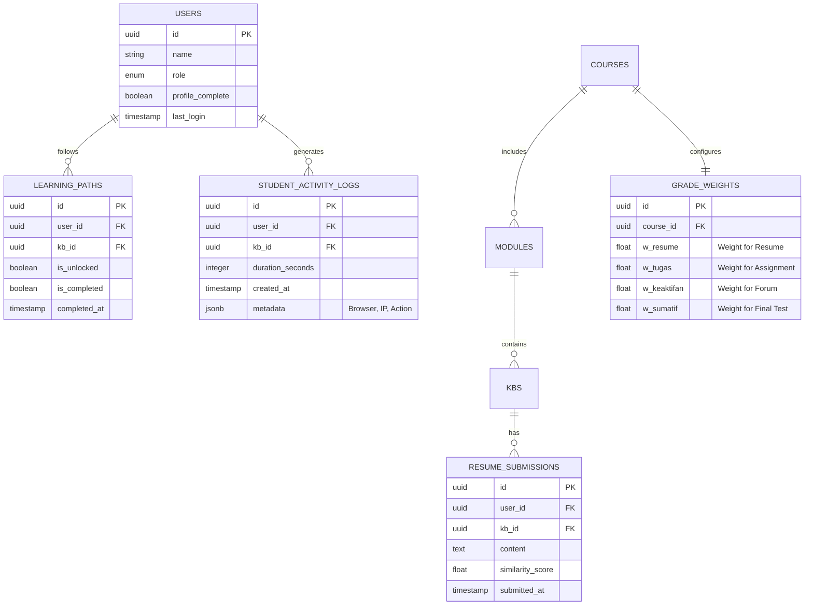

# MTsN 4 Jombang LMS Architecture

## 1. High-Level System Architecture (Mermaid)

```mermaid
graph TD
    User((User/Student)) --> Auth[Authentication Service]
    Auth --> ProfileGate{Profile Locked?}
    ProfileGate -- No --> Dashboard[Learning Dashboard]
    ProfileGate -- Yes --> ProfileEdit[Profile Verification]
    
    Dashboard --> Scheduler[Pacing & Scheduler Engine]
    Scheduler --> Prerequisite{Prerequisite Check}
    
    Prerequisite -- Pass --> Activity[Activity Logger]
    Activity --> Material[Material Viewer]
    Material --> Resume[Smart Resume Tool]
    Resume --> Similarity[Similarity Check API]
    
    Activity --> GradeEngine[Automated Weighted Grading]
    GradeEngine --> DB[(PostgreSQL & Redis)]
    
    Teacher[Guru/Supervisor] --> Monitoring[Dashboard Monitoring Real-time]
    Monitoring --> DB
```

## 2. Database Schema (ERD)

```mermaid
erDiagram
    USERS ||--o{ LEARNING_PATHS : follows
    USERS ||--o{ STUDENT_ACTIVITY_LOGS : generates
    MODULES ||--o{ KBS : contains
    KBS ||--o{ RESUME_SUBMISSIONS : has
    COURSES ||--o{ MODULES : includes
    COURSES ||--|| GRADE_WEIGHTS : configures
    
    USERS {
        uuid id PK
        string name
        enum role
        boolean profile_complete
        timestamp last_login
    }
    
    STUDENT_ACTIVITY_LOGS {
        uuid id PK
        uuid user_id FK
        uuid kb_id FK
        integer duration_seconds
        timestamp created_at
        jsonb metadata "Browser, IP, Action"
    }
    
    LEARNING_PATHS {
        uuid id PK
        uuid user_id FK
        uuid kb_id FK
        boolean is_unlocked
        boolean is_completed
        timestamp completed_at
    }
    
    RESUME_SUBMISSIONS {
        uuid id PK
        uuid user_id FK
        uuid kb_id FK
        text content
        float similarity_score
        timestamp submitted_at
    }
    
    GRADE_WEIGHTS {
        uuid id PK
        uuid course_id FK
        float w_resume "Weight for Resume"
        float w_tugas "Weight for Assignment"
        float w_keaktifan "Weight for Forum"
        float w_sumatif "Weight for Final Test"
    }
```
